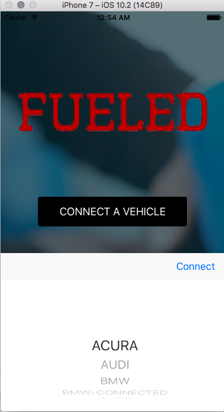

# Smartcar iOS Auth SDK

[](https://travis-ci.com/smartcar/ios-sdk/)
[](http://cocoapods.org/pods/SmartCarOAuthSDK)
[](http://cocoapods.org/pods/SmartCarOAuthSDK)
[](http://cocoapods.org/pods/SmartCarOAuthSDK)

The Smartcar iOS Auth SDK makes it easy to handle the Smartcar OAuth flow from
iOS. In addition, it provides UI elements (buttons, picker) to easily integrate
the flow into your application.

The SDK follows the best practices set out in [OAuth 2.0 for Native Apps](https://tools.ietf.org/html/draft-ietf-oauth-native-apps-06)
including using _SFSafariViewController_ on iOS for the authorization request.
_UIWebView_ is explicitly not supported due to usability and security reasons.

## Requirements

SmartcarAuth supports iOS 7 and above.

iOS 9+ uses the in-app browser tab pattern (via _SFSafariViewController_), and
falls back to the system browser (mobile Safari) on earlier versions.

## Installation

SmartcarAuth is available through [CocoaPods](http://cocoapods.org). To install
it, simply add the following line to your Podfile:

```ruby
pod "SmartcarAuth"
```

## Authorization

First you need to have a global SmartcarAuth object in your AppDelegate to hold
the session, in order to continue the authorization flow from the redirect.

```swift
// global variable in the app's AppDelegate
var smartcar: SmartcarAuth? = nil
```

Then, initiate the authorization request.

```swift
let appDelegate = UIApplication.shared.delegate as! AppDelegate
appDelegate.smartcar = SmartcarAuth(clientID: clientId, redirectURI: redirectURI, scope: scope)
let smartcar = appDelegate.smartcar

// initialize authorization request for Acura
smartcar.initializeAuthorizationRequest(for oem: OEMName.acura, viewController: viewController)
```

### Request Configuration

`clientId`

Application client ID obtained from [Smartcar Developer Portal] (https://developer.smartcar.com/).

`redirectURI`

Your app must register a custom URI scheme with iOS in order to receive the
authorization callback. Smartcar requires the custom URI scheme to be in the
format of `"sc" + clientId + "://" + hostname`. This URI must also be registered
in [Smartcar's developer portal](https://developer.smartcar.com) for your app.
You may append an optional path component or TLD (e.g. `sc4a1b01e5-0497-417c-a30e-6df6ba33ba46://oauth2redirect.com/page`).

More information on [configuration of custom scheme] (http://www.idev101.com/code/Objective-C/custom_url_schemes.html).

`scope`

Permissions requested from the user for specific grant. See the [Smartcar developer documentation](https://developer.smartcar.com/docs)
for a full list of available permissions.

`forcePrompt` (optional)

Defaults to `ApprovalType.auto`. The auto option will skip the approval prompt
for users who have already accepted the requested permissions for Your
application in the past. Set to `ApprovalType.force` to force a user to see the
approval prompt even if they have already accepted the permissions in the past.

`development` (optional)

Defaults to `false`. Set to `true` to enable the Mock OEM.

### Handling the Redirect

The authorization response URL is returned to the app via the iOS openURL app delegate method, so you need to pipe this through to the current authorization session

```swift
/**
	Intercepts callback from OAuth SafariView determined by the custom URI
 */
func application(_ application: UIApplication, handleOpen url: URL) -> Bool {
    // Close the SFSafariViewController
    window!.rootViewController?.presentedViewController?.dismiss(animated: true , completion: nil)

    // Sends the URL to the current authorization flow (if any) which will
    // process it if it relates to an authorization response.
    do {
        let code = try smartcar!.resumeAuthorizationFlowWithURL(url: url)
               
        if window?.rootViewController! is ViewController {
            var vc = window?.rootViewController! as! ViewController
            vc.accessCodeReceived(code: code)
        }
    } catch {
        print("Error caught")
    }
    
    // Your additional URL handling (if any) goes here.

    return true
}
```

## UI Components

### SmartcarAuthButtonGenerator

The button generator allows you to create individual buttons for each OEM which
are styled with the OEM's logo and colors.

Here are an example of a BMW button: 


In this example we initialize the Client SDK and generate a single button to
initiate the OAuth flow for Tesla.

```swift
// global SmartcarAuthButtonGenerator variable to store the button and action
var ui: SmartcarAuthButtonGenerator? = nil
    
func mainFunction {
    
    let appDelegate = UIApplication.shared.delegate as! AppDelegate
    appDelegate.smartcar = SmartcarAuth(clientID: Config.clientId, redirectURI: "sc" + Config.clientId + "://page", scope: ["read_vehicle_info", "read_odometer"])
    let smartcar = appDelegate.smartcar

    // initialize ButtonGenerator
    ui = SmartcarAuthButtonGenerator(sdk: smartcar!, viewController: self)
    
    let button = ui!.generateButton(frame: CGRect(x: 0, y: 0, width: 250, height: 50), for: OEMName.tesla)
    self.view.addSubview(button)
    
    // add autolayout constraints
    button.translatesAutoresizingMaskIntoConstraints = false
    let buttonPinMiddleX = NSLayoutConstraint(item: button, attribute: .centerX, relatedBy: .equal, toItem: self.view, attribute: .centerX, multiplier: 1.0, constant: 0)
    let buttonPinMiddleY = NSLayoutConstraint(item: button, attribute: .centerY, relatedBy: .equal, toItem: self.view, attribute: .centerY, multiplier: 1.5, constant: 0)

    //make sure contraint width is equal to frame width
    let buttonWidth = NSLayoutConstraint(item: button, attribute: .width, relatedBy: .equal, toItem: nil, attribute: .notAnAttribute, multiplier: 1, constant: 250)
    let buttonHeight = NSLayoutConstraint(item: button, attribute: .height, relatedBy: .equal, toItem: nil, attribute: .notAnAttribute, multiplier: 1, constant: 50)

    self.view.addConstraints([buttonPinMiddleX, buttonPinMiddleY, buttonWidth, buttonHeight])
}
```

### SmartcarAuthPickerGenerator

Similar to SmartcarAuthButtonGenerator, the picker provides an easy way to allow
users to select between multiple OEMs via the UIPickerView.

```swift
let button = ui!.generatePicker(frame: CGRect(x: 0, y: 0, width: 250, height: 50))
self.view.addSubview(button)
```

Below is the generated UIPickerView in action

<p align="center">
  
</p>

## Example

To run the example project, clone the repo, and run `pod install` from the Example directory first.

Create a Config.swift file to store the clientId Config constant

```swift
struct Config {
    static let clientId = "PUT CLIENT ID HERE"
}
```

Edit Info.plist to adhere to the custom URI scheme stated above and then run the example

## Author

Smartcar Inc., hello@smartcar.com

## License

SmartcarAuth is available under the MIT license. See the LICENSE file for more info.
