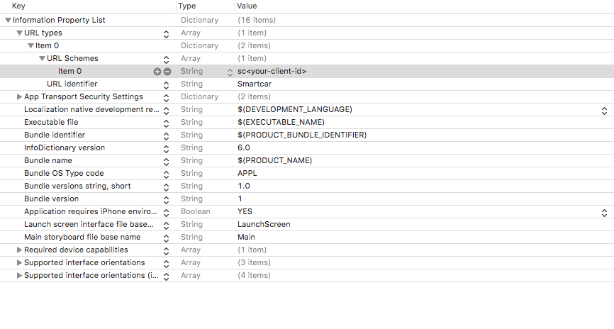

# Smartcar iOS Auth SDK

[](https://travis-ci.com/smartcar/ios-sdk/)
[](http://cocoapods.org/pods/SmartcarAuth)
[](http://cocoapods.org/pods/SmartcarAuth)
[](http://cocoapods.org/pods/SmartcarAuth)

The SmartcarAuth iOS SDK makes it easy to integrate with Smartcar Connect from iOS.

The SDK follows the best practices set out in [OAuth 2.0 for Native Apps](https://tools.ietf.org/html/draft-ietf-oauth-native-apps-06) including using _SFSafariViewController_, _SFAuthenticationSession_, or _ASWebAuthenticationSession_ depending on iOS version for the authorization request. _UIWebView_ is explicitly not supported due to usability and security reasons.

## Requirements

SmartcarAuth supports iOS 10 and above.

iOS 10 uses the in-app browser tab pattern (via _SFSafariViewController_), iOS 11 presents the authentication webpage in Safari using _SFAuthenticationSession_, and iOS 12 and above uses a secure embedded webview (via _ASWebAuthenticationSession_).

## Installation

SmartcarAuth is available through [CocoaPods](http://cocoapods.org). To install it, simply add the following line to your Podfile:

```
pod "SmartcarAuth"
```

## Getting Started

First, you need to have a global SmartcarAuth object in your AppDelegate to hold the session, in order to continue the authorization flow from the redirect.

```swift
// global variable in the app's AppDelegate
var smartcarSdk: SmartcarAuth? = nil
```

Next, you will need to configure your redirect URI. Your redirect URI must follow this format: `"sc" + clientId + "://" + hostname`. 

If you are supporting iOS 10 with your application, you will also need to register your custom URL scheme (`sc<clientId>`) in your `Info.plist`:


Then, initiate the SmartcarAuth object in the UIViewController.

```swift
let appDelegate = UIApplication.shared.delegate as! AppDelegate

func completionHandler(code: String?, state: String?, err: AuthorizationError?,) -> Void {
 // Receive authorization code
}

appDelegate.smartcar = SmartcarAuth(
  clientId: "afb0b7d3-807f-4c61-9b04-352e91fe3134",
  redirectUri: "scafb0b7d3-807f-4c61-9b04-352e91fe3134://exchange",
  scope: ["read_vin", "read_vehicle_info", "read_odometer"],
  completion: completionHandler
)
let smartcar = appDelegate.smartcar

// Generate a Connect URL
let authUrl = smartcar.authUrlBuilder().build()

// If you are developing for iOS 11 and above only, you can launch Connect without passing in a viewController
smartcar.launchAuthFlow(url: authUrl)

// If you are developing for iOS 10 and above, you will need to pass in a viewController
smartcar.launchAuthFlow(url: authUrl, viewController: viewController)
```

## Handling the Redirect

For iOS 11 and above, the callback URL with the authentication code (or error) is passed back to the application by the session, and the URL is passed to the completion handler and no further action to intercept the callback is required.

For iOS 10, the Connect response is returned to the app via the iOS openURL app delegate method, so you need to pipe this through to the current authorization session.

```swift
/**
	Intercepts callback from OAuth SafariView determined by the custom URI
 */
func application(_ application: UIApplication, open url: URL, options: [UIApplicationOpenURLOptionsKey : Any] = [:]) -> Bool {
    // Close the SFSafariViewController
    window!.rootViewController?.presentedViewController?.dismiss(animated: true , completion: nil)

    // Sends the URL to the current SmartcarAuth object which will
    // process it and then call the completion handler.
    if let sdk = smartcarSdk {
        sdk.handleCallback(url: url)
    }

    // Your additional URL handling (if any) goes here.

    return true
}
```

## SDK Reference

For detailed documentation on parameters and available methods, please refer to
the [SDK Reference](https://smartcar.github.io/ios-sdk/).

## Author

Smartcar Inc., hello@smartcar.com

## License

SmartcarAuth is available under the MIT license. See the LICENSE file for more info.
